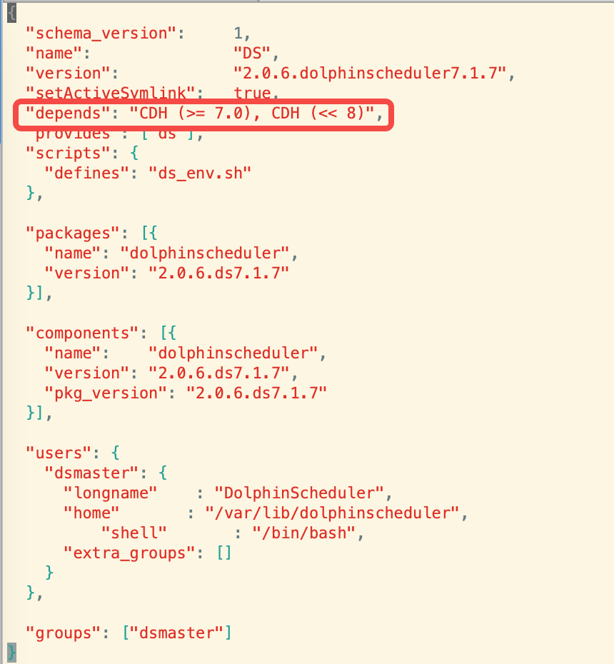
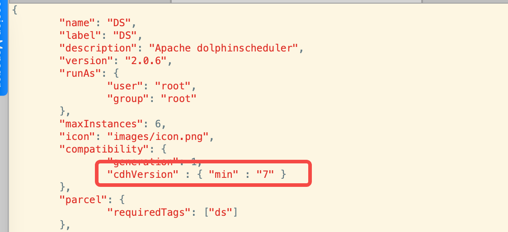
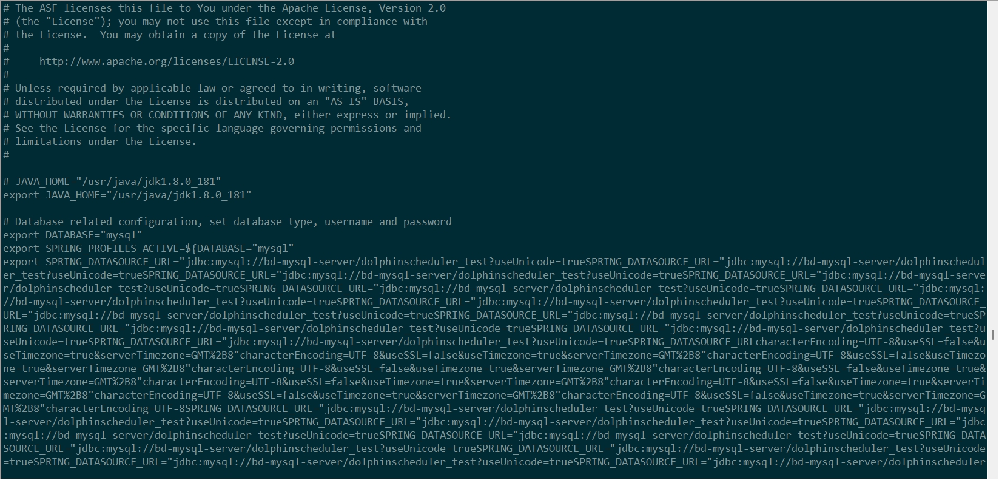

# dolphinscheduler-cdh-parcels
对dolphinscheduler-3.1.7进行打包，托管到CDH6.3.2集群  

#### parcels包资源地址
链接: https://pan.baidu.com/s/1KL-tRHuiII6TFn4cAVmwkA  密码: sk2u

#### 包目录结构
##### parcels
```text
dolphinscheduler-3.1.7
    ├── lib
    │   ├── dolphinscheduler
    ├── meta
    │   ├── parcel.json
    │   └── ds_env.sh
```
dolphinscheduler3.1.7下载链接 https://dlcdn.apache.org/dolphinscheduler/3.1.7/apache-dolphinscheduler-3.1.7-bin.tar.gz

#### csd
```text
dolphinscheduler-3.1.7
    ├── descriptor
    │   └── service.sdl
    ├── images
    │   └── icon.png
    ├── scripts
    │   └── control.sh

```
#### parcel打包步骤
1、parcels打包
```shell script
tar -zcvf DS-3.1.7.dolphinscheduler6.3.2-el7.parcel DS-3.1.7.dolphinscheduler6.3.2
# 验证
java -jar validator.jar -f DS-3.1.7.dolphinscheduler6.3.2-el7.parcel
```
生成哈希文件
```shell script
sha1sum DS-3.1.7.dolphinscheduler6.3.2-el7.parcel
```
2、csd打包

```shell script
jar -cvf DS-3.1.7.jar csd/*
```

### CDH集群版本修改
1、修改parcel包中parcel.json文件depends属性


2、修改csd包中service.sdl文件cdhVersion属性



3、 暂时未解决问题
