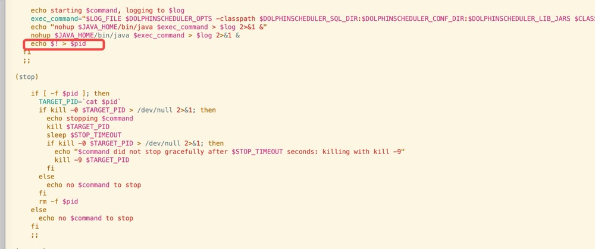

### 1、cdh缓存问题
在cdh界面分配激活后，会在parels目录留有一个.flood的隐藏目录。如果我们修改内容重新打包parcel，仅仅是替换parcel-repo下的文件是不生效的，cdh会优先从.flood中获取。
**解决方案**
清除所有节点.flood下对应的文件，并删除parcel-cache路径下对应的torrent文件
### 2、cdh角色状态判断问题
在官方dolphinscheduler的执行脚本dolphinscheduler-daemon.sh中，所有的服务启动时都是后台启动模式
```shell script
nohup $JAVA_HOME/bin/java $exec_command > $log 2>&1 &
```

这样就导致了在cdh执行启动操作后，服务实际上已经启动了，但cdh检测不到，造成的现象ds服务状态启动，但所有角色停止。
并因此引发了另一个问题：在cdh无法执行停止操作（因为cdh任务所有的角色都已经停止了），而且还给出了一个错误的引导，在执行停止的时候，界面会显示 (csd.sh star)(这个坑我吐了)
**解决方案**
拷贝原来的脚本命名为dolphinscheduler-daemon-cdh.sh，改成前台挂起启动：
```shell script
nohup $JAVA_HOME/bin/java $exec_command > $log 2>&1
```


### 3、此问题是是因为问题2的解决方案引起的
在原来的dolphinscheduler-daemon.sh中启动服务后，会把对应进程保存在pid目录中，用于stop操作。

由于cdh要求服务进程挂起，保存进程号的命令无法被执行，这会导致stop操作停止不了服务。
**解放方案**
修改dolphinscheduler-daemon-cdh.sh stop操作脚本
```shell script
 (stop)

      pid=$(ps x | grep $serverName  | grep -v grep | awk '{print $1}')
        if [ -z "$pid" ]
        then
            echo "no $command to stop"
        else
            echo "stopping $command $pid"
            for pid in ${pid[*]}
            do
              kill $pid
              sleep $STOP_TIMEOUT
              if kill -0 $pid > /dev/null 2>&1; then
                echo "$command did not stop gracefully after $STOP_TIMEOUT seconds: killing with kill -9"
                kill -9 $pid
              fi
            done
            sleep 5
        fi
      ;;
```
